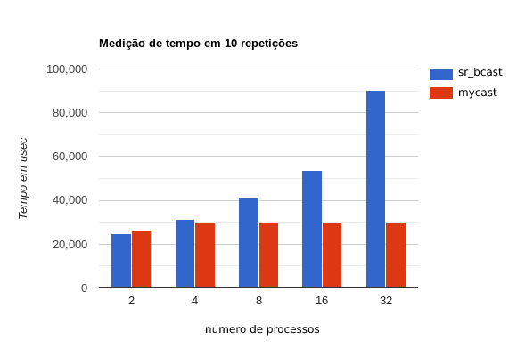
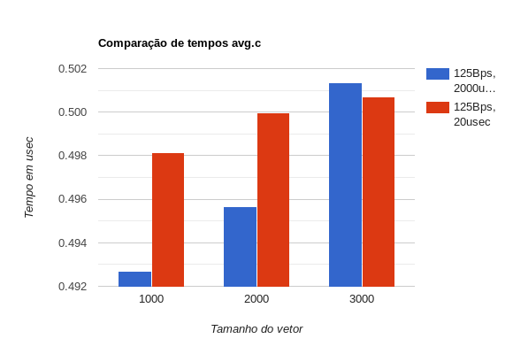
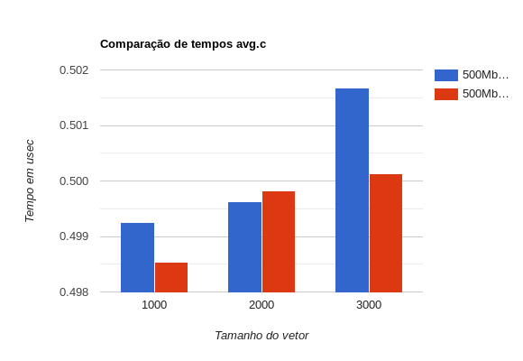

# Entrega
[Programação Paralela](https://github.com/jviriato/elc139-2019a) > [Trabalhos](trabalhos) > [t7](/trabalhos/t7)

**Nome**: José Victor Viriato

**Disciplina**: Programação Paralela

**Specs**:

Sistema Operacional: Ubuntu 18.04

Memória RAM: 8GB

Processador: Intel(R) Core(TM) i5-5200U

Frequência: 2.20GHz

Núcleos: 2

## Parte 1

O gráfico pode ser conferido à seguir:

Em host speed foi utilizado segundo o meu processador, na tabela fornecida pelos slides

## Parte 2

Os gráficos podem ser conferidos à seguir:

|          |                  |          |       |          | 
|----------|------------------|----------|-------|----------| 
| Num Proc | Largura de Banda | Latência | Vetor | Tempo    | 
| 9        | 125Bps           | 2000us   | 1000  | 0,49269  | 
| 9        | 125Bps           | 2000us   | 2000  | 0,495641 | 
| 9        | 125Bps           | 2000us   | 3000  | 0,501341 | 
| 9        | 125Bps           | 20us     | 1000  | 0,49813  | 
| 9        | 125Bps           | 20us     | 2000  | 0,499964 | 
| 9        | 125Bps           | 20us     | 3000  | 0,500708 | 

|          |                  |          |       |          | 
|----------|------------------|----------|-------|----------| 
| Num Proc | Largura de Banda | Latência | Vetor | Tempo    | 
| 9        | 500Mbps          | 2000us   | 1000  | 0,499247 | 
| 9        | 500Mbps          | 2000us   | 2000  | 0,499626 | 
| 9        | 500Mbps          | 2000us   | 3000  | 0,50167  | 
| 9        | 500Mbps          | 20us     | 1000  | 0,498542 | 
| 9        | 500Mbps          | 20us     | 2000  | 0,499824 | 
| 9        | 500Mbps          | 20us     | 3000  | 0,500136 | 

